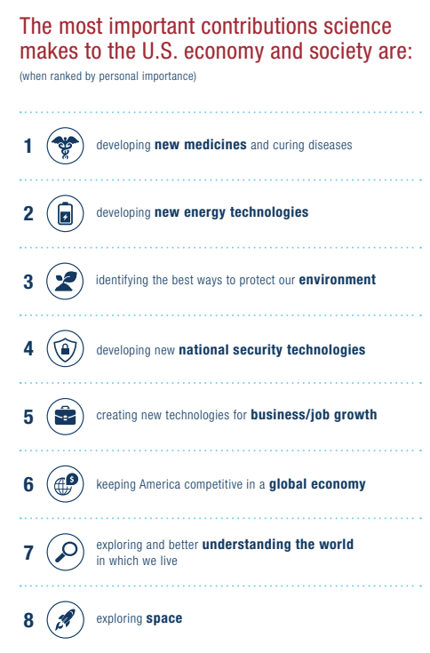

:::{important}
This is a draft and very incomplete! There are a few good ideas on trying to sketch out the analogies between open-science and open-source development, specifically looking to Developer Operations (DevOps) teams and continuous practices.
:::

::::{important} Video Walkthroughs of Ideas
:class: dropdown

:::{iframe} https://www.loom.com/embed/28898917ad054d38b7e868ca6b73336c
This video goes through some of the motivations of working on this problem and sets up a framework for thinking about how we change processes. Primarily this is framed around MyST. Linked talks are [refactoring geoscience education](https://www.youtube.com/watch?v=IW2LDsevvDk) and [deploying a reproducible course](https://www.youtube.com/watch?v=XY3Tq9Wd1_A).
:::

:::{iframe} https://www.youtube-nocookie.com/embed/uSbjpiUsdT0?si=Hun1k4jwqhxmpTvx
Goes through these same ideas in a presentation format, presentation through the SimPEG Seminar (https://seminars.simpeg.xyz/seminars/2022-04-cockett), built in MyST!
:::
::::

## Accelerating the speed of scientific breakthroughs

Difficult problems that are globally relevant and urgent - like climate change, pandemics, and water security - require us to radically rethink how we share knowledge and work on scientific breakthroughs. The demands of science [from society](https://www.sciencecoalition.org/wp-content/uploads/2020/03/Why-Fund-Science.pdf) are ever increasing to provide solutions and insights to these global challenges: new medicines, cure disease, new energy technologies, better ways to protect the environment, new technologies for economic growth and national defense, as well as better understanding the world we live in[^why-fund-science].

[^why-fund-science]:
    [Why fund science](https://www.sciencecoalition.org/wp-content/uploads/2020/03/Why-Fund-Science.pdf)? This is what the US thinks about.
    

> How do we improve the speed at which science can produce these scientific breakthroughs?!

A common objection to accelerating science is by pointing at all of the potentially drastic consequences of increasing speed — scientists will burn out, we will decrease rigour, we are already overloaded by mountains of information, and who will review all the work?!

These challenges and consequences are very real. Scientists already work 53.96 hours a week on average, and only about 36% of their time is actually spent on research (8% on grants, 32% on teaching, and 24% on service) [@Link2008time]. Graduate students are six times more likely to experience depression than the general population [@Evans2018Evidence]. There are [2.6 million](https://www.universityworldnews.com/post.php?story=20180905095203579) scientific papers published every year and it is growing. The time it takes for the peer-review process is over three months, in high profile journals like Nature that time has almost doubled over the past decade [@Powell2016Does]. Rejections are anywhere from 50-90% [@Grossmann2021Current] with valuable reviews and expertise coming months or even years after the work is completed.

Simply saying “more of this, but faster” will exacerbate all of these problems. Instead, the way that science is conducted, evaluated and communicated requires radical change. Luckily, many of these changes are happening. There are institutional, national and cultural shifts towards open-access [@Else2018Radical] and there is beginning to be the normalization of preprints in many more fields [@Else2020How]. These are massive, and ongoing accomplishments that are changing the nature of scientific communication. The next decade of science-communication will be transformative (schematically shown in [](#fig:paradise) as paradise!).

```{figure} images/force11-2019.png
:name:fig:paradise
:width: 60%

Günter Waibel talking at Force11 in 2019 about where we are on our journey towards open access science. And sketching a final push over the hump and a journey towards paradise 🏝. [Video here](https://www.youtube.com/watch?v=pB7R-juNaCg&list=PLtYOue8U25N1hFfRmMlOsYFGTDHnKjlLA).
```

One of the questions that I think about is what comes _after_ all of science switches to open-access? Are we done? Is that actually the paradise described? What other industries can science look to who have gone through a similar shift?

## Comparing open-access & open-source

One analogy to look at is comparing the production and sharing of software to the production and sharing of knowledge. These analogies are illuminating, but not prescriptive. The journey scientific communication and technical knowledge production will take is distinct from software engineering and the pressures and requirements of business are very different than academia.

> Scientific exploration and experimentation is different from programming. \
> Writing is different than programming.

Most scientists are not trained in software development and the tools built for programmers are necessarily complex but difficult to adopt and don’t quite fit. Researchers focus much of their time on writing, teaching, presenting, experimenting, and exploring new ideas. Many of these use-cases are just not supported or are needlessly complicated.

With that disclaimer, we will look at two aspects of software development:

1. open-source development and infrastructure for sharing; and
2. organizing and incentivizing teams through continuous practices.

The timing of the open-access shift in scientific publishing has many analogues to where open-source was in the early 2000’s, with new distributed collaboration tools invented (e.g. Git in 2005) and new companies for collaboration, sharing and discovery built on these new ways of working (e.g. Atlassian & GitHub founded in 2002 & 2008, respectively). In software-development today, it is possible for two people who have never met to reuse each others ideas (in this case, software packages), and actually improve, fix and generalize these ideas. It happens without them meeting, planning, or really thinking about the coordination at all — which, frankly, is amazing. The coordination that brings together working and sharing is built into various levels of the infrastructure. The necessary first step in this scenario is clear and open licensing of content, which in science is the open-access movement, supported through legal tools like the Creative Commons Licenses (e.g. CC-BY).

## Infrastructure for Working

This is JupyterHubs and community-based model that 2i2c is pioneering with various research communities.

There is a role for a new position whose job is the cultural and behavioral influencers, who align the system who improve the speed by changing the process of science. There is a similar roles that we can map out as dev-ops, on good team structures and anti-patterns (see [devops topologies](https://web.devopstopologies.com)) - some of these conversations are ongoing as the role of a Research Software Engineer, and in organizations like 2i2c and Curvenote who are external service providers to communities.

## Infrastructure for Sharing

There are two aspects of sharing software, first while it is being developed and secondly as a dependency to be used by other people. Both of these modes of sharing have dedicated infrastructure in development practices with shared standards and ecosystems. For example, Git and GitHub are generally used as standards for sharing open-source software throughout the development lifecycle. The services and standards changed the software industry fundamentally by enabling completely new modes of collaboration and ad-hoc organizational models to motivate, empower and connect people.

Secondly, there are vast amounts of effort spent on facilitating sharing of software packages with multiple versions and intricate levels of dependencies. Package-managers like PyPI, NPM, and Conda all have different ways to enable individuals and organizations to independently state their versions, dependencies and licenses as well as the tooling to download, use and upgrade those packages.

Compare this to how knowledge work is shared both as in-progress work and in a "packaged" form.

"Dependency management" aka the references section of a document is often, still, text-only citations at the bottom of a Word document. In progress work has zero ability to have automated value from the listing of these dependencies. Further more, providing granular attribution to figures, equations, or even sections of text is impossible in todays editing interfaces and reading mediums. If attribution of content is lost, perhaps due to poor interfaces for creating technical documents, this can lead to high-profile cases of plagiarism accusations (e.g. [Claudine Gay](https://www.theguardian.com/education/2024/jan/06/harvard-claudine-gay-plagiarism) and [Neri Oxman](https://www.businessinsider.com/bill-ackman-wife-neri-oxman-mit-dissertation-plagiarism-2024-1) copying text from Wikipedia and other sources).

The legal possibility of reuse from open-access licensing will start to challenge social norms and concepts of plagiarism, authorship, and contribution. If an author shares their work with a CC-BY license, the legal definition says you can reuse it if you attribute the source. Social norms, however, are quite different[^cc-by-plagiarism].

[^cc-by-plagiarism]: “Can I reuse that great introduction paragraph - it is perfect!” “Nope, that’s still plagiarism!” “Wait what?! It is openly licensed!”.

These are _exciting_ questions and thought experiments that will require more sophisticated ways of tracking attribution, licensing, changes, and suggestions. In the same way that licensing in the programming world opened possibilities for collaborations between unknown contributors, it also required new technologies and infrastructure to really get off the ground.

Dependency management in research is primarily driven by print-based requirements: APA formatting says put a `.` after the year in brackets, ensure that there is a `p. 42` in your in-text reference. These are important for print-based thinking and looking up content in a [library catalog](https://en.wikipedia.org/wiki/Library_catalog). In a digital world, we should be referring directly to the equation, paragraph, or computational figure through persistent links and the reading and authoring interfaces should be able to fully attribute that reference, show you a preview with appropriate licensing, and automatically generate your references section for you. It should be as easy as pasting a link or hovering over one. Additionally, this content must be machine-readable in addition to interfaces that are designed for the reading and browsing experience. In an open-access context getting faster access to content while you are reading (e.g. hover over a reference and read the abstract and/or browse the figures without leaving the page!); this can speed up comprehension of an article by 26% [@10.1145/3411764.3445648].

The infrastructure to build these sharing and authoring experience is unfortunately severed from scientists day-to-day work, and is currently a very manual process of typesetting completed by many scientific publishers. JATS is the standard for professional scientific content, and the typesetting process that an article goes through after it is accepted for publication is typically 3-5 weeks; this is when a researcher receives a proof and potentially an online copy, if you are in the biosciences, a copy of the structured data (as XML) is deposited with PubMed who act in a similar way to the "package managers" in development.

This is a _vastly_ different model to how software development works, where anyone can publish a package at any time to contribute to the overall ecosystem. Instead of gate-keeping, these ecosystems focus on automation and have different models of curation and signal boosting to give quality signals for packages (last updated, number of downloads last week, license information, etc.). Software package management can also be versioned because the processes for publishing are automated, unlike the manual 3-5 week process for adding metadata in traditional scientific publishing.

The process of how we move from idea, feedback, iterate, and share both privately in a lab-group/community or publicly in a traditional journal will have a vast impact on the speed with which new ideas are disseminated, picked up and acted upon. An important research idea that is shared months earlier as a pre-print or gets out 3 weeks sooner because typesetting is automatic is months earlier that it can be acted on by other practitioners or improved upon by other researchers. The challenge with PDF pre-prints is that these are often metadata poor, for example in the references, funding information, or structured content, and the cost to adding this scholarly metadata can be prohibitive or simply out of scope for a pre-print server.

As a comparison, think of publishing a software package on PyPI where you can only list your packages dependencies if you pay a $2500 charge (per version) and wait weeks to months. The complex and vibrant collaboration workflows that are happening in open-source software development would never get off the ground. Professionalizing and automating these processes into the research writing and reading workflows _as the research is being conducted_ could potentially unlock massive collaborative potential.

The overhead for doing this needs to not be completed as professional typesetting at the end of a study, but as you are writing your research, notes, comments and presentations. The infrastructure for sharing this work, either privately within an community or at a later-date publicly needs to integrate and contribute to the wider scientific infrastructure.

:::{prf:example} Example: Sharing Tutorials
Importing a data-science tutorial on how to access a dataset in CryoCloud. The only way we have to do this today is with copy-paste and a text link that you hopefully remember, and maybe manually checking for updates when you have time.

These are practical examples of working outside of the scientific collaboration ecosystem, where there is no ability to propagate attribution, updates, versions or credit. The failure of our lack of infrastructure for sharing means that there is no opportunity or incentive to improve and _iterate in place_ on an idea, every person who wants to include one of these tutorials for their community, course, or supplementary materials must also copy/paste the content and then start out on their own.
:::

:::{prf:example} Example: Seminars and Workshops
SimPEG seminar hosted weekly (e.g. [here](https://seminars.simpeg.xyz/seminars/2022-04-cockett)), can be a way to showcase scholarly content in a more professional way, and have DOIs land on pages that are designed for the work and showcase it integrated to your other content.
:::

## Continuous Practices in Software

The practices of software development are well studied, with large-scale surveys of organizational performance, design, robustness, and speed ([DORA Reports](https://www.devops-research.com/research.html)). The main questions asked in the DORA Reports are how do companies improve the speed with which they can deliver software (tied to improved efficiency, profit and customer satisfaction), while not sacrificing rigour/quality or burning out employees.

> How do we accelerate the rate of scientific breakthroughs while also improving rigour, collaboration, mental-health, accessibility, and reproducibility in science?

The [2018 DORA Report](https://services.google.com/fh/files/misc/state-of-devops-2018.pdf) compared elite teams with low-performing teams for software delivery, and found that the elite teams were 46x faster, had 7x fewer errors, spent 20% more time on new work, had 5-20% less manual work, and were 1.8x more likely to recommend their team as a great place to work. _Let that sink in!_

> 46x faster. 7x fewer errors. 20% more time for new work. 5-20% less manual work. 1.8x more likely to love where they work.

As an unfair comparison: during COVID19, society managed to produce and manufacture a vaccine safely in [5-10x less time](https://coronavirus.jhu.edu/vaccines/timeline), but that has come at a cost in burnout, stress, loss of trust in scientists, and misinformation [@Gewin2021Pandemic; @Algan2021Trust]. The demands on science are mounting to deliver more scientific breakthroughs faster as humanity faces massive global challenges around climate, health and energy.

The analogies between open-access and open-source movements give us an opportunity to peek ahead 15 years to an analogous future and draw on the learnings of how the open-source development, and learnings on how to organize and focus infrastructure to get the best out of our community.

## Continuous Practices in Science

We will focus on three areas:

- Changing the unit of scholarship towards smaller, reusable contributions (Force11)
- Distribute sharing and peer-review throughout the process of science
- Integrate data, computation and testing into how science is communicated

This is a powerful reminder that designing systems and infrastructure that empower individuals to work together, rapidly share updates, and have direct as well as automated feedback can fundamentally change ...

Modern processes of peer-review are relatively recent, mostly being institutionalized in the 1970s-1990s (see [peer-review history](https://mitcommlab.mit.edu/broad/commkit/peer-review-a-historical-perspective)) and these processes are now used by indexers, funders and society to say which research "counts".

Currently many of these steps in conducting science are designed to happen in a consecutive sequence: define a problem or research area to secure grant funding, collect data, analyze and interpret the results, craft those results into a narrative — the scientific paper — submit it to be reviewed by peers, and finally share the finished work to inspire and be cited by future publications.

There are a lot of challenges in this workflow, for

- Peer review is expensive and less-effective at the _end_ of the process.
  - The authors of a work are often more interested in finishing, than incorporating feedback
    - incremental review, at the time of creation is more **effective, corrective and instructive**.
    - Authors may defend their work when feedback comes at the end, rather than framing as a collaborative improvement of the work
  - Peer review is treated _hurdle_ to get through, rather than an opportunity to learn, refine and improve.
    - See Review 3

Artifacts that are produced along the way.

```{figure} images/continuous-science.png
:name: fig:continuous-science
:align: center
:width: 70%
```

## Elements of Continuous Science

- Smaller units (think a figure or blog post rather than manuscript)
- Closer community to work with
- Peer review happens continuously on smaller pieces of work
  - think of your peers reviewing and giving constructive feedback not PeerReview™
- Checking of references are automated and can tailor to community guidelines (e.g. everything must have a license)
- ability to automatically submit and

:::{figure} ./images/checks.gif
Ability to check the structure of an artifact to ensure it meets some automated quality controls for things like references, links, author identifiers (e.g. ORCID), or funding information. Here we are running a set of checks with Curvenote to provide some level of unit-testing on communication artifacts.
:::

:::{figure} ./images/submit.gif
Ability to programmatically deploy and update submission artifacts. For example to a community venue, that can then apply processes of peer-review (at the appropriate rigor) and sharing them with the community or wider world.
:::

> The only difference between a a journal a blog should be the community around it, not the tools used to publish your work

**Need it be open?** Continuous science need not be open, or fully transparent as the work is ongoing. Small groups of trusted collaborators or a community with enforced social norms are places where individuals can take risks and try out ideas. Transitioning from that private collaboration into a open-science-spaces, however, should be seamless.

## Networked Science (Working across the puzzle pieces)

- What do the imports look like across communities?
- How do we bring computation and content into my community infrastructure?

> “We see a future in which scientific information and scholarly communication more generally become part of a global, universal and explicit network of knowledge; where every claim, hypothesis, argument—every significant element of the discourse—can be explicitly represented, along with supporting data, software, workflows, multimedia, external commentary, and information about provenance.”
>
> “This vision moves away from the paper-centric model of the scholarly literature, towards a more distributed network-centric model” that “vastly improves knowledge transfer and [has a] far wider impact.”
>
> - [@10.4230/DagMan.1.1.41]

Too much peer review.

- Getting the review at the right time.

Prestige model

- That is a big problem.
- Pay for prestige.

Earlier then you get the feedback.

Just the productivity side?

- The need for standardization
- Standard metrics for accomplishments

It is a continuum.

Early adoption:

- want 1% of users.
- intersection between open-source / open-science

## Outline on comparing

- Open-source
  - Legal
  - Technical
  - Social
- Organizationally
  - Smaller
  - Automated
  - Continuous
